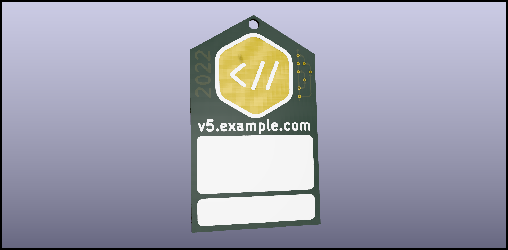
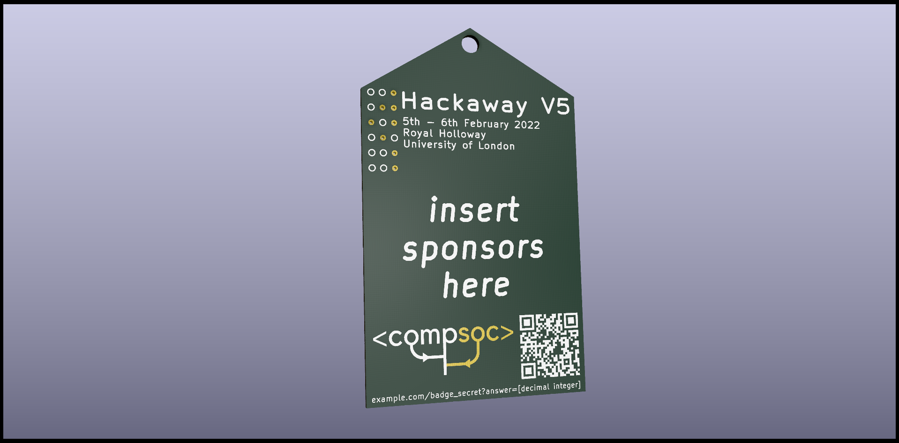

# royalhackaway.badge

PCB Badges for Royal Hackaway v6 (no PCBs at v5), currently still in development (and in need of sponsors)

- [Royal Hackaway v5](https://royalhackaway.com/events/hackawayv5/)

## Images

  

## Setup

1. Install KiCad 5.1.9 (or above?)
2. Open the `hackawaycard.pro` project file
3. Open the _PCB Layout Editor_ to modify the PCB
    - 

## Image to PCB

To convert an image to place onto the PCB:

1. Click the _Bitmap to Component Converter_
    - 
2. Import a bitmap. For multi-coloured images, it's advised to explode the colours into multiple, easily selectable distinct sections
    - 
3. Modify the DPI to match the output size (in mm) that you wish for the image to be
4. Export the file to the _hackaway.pretty_ folder
5. In `pcbnew`, open the _Footprint Editor_
    - 
6. Find your component in the list of libraries on the left.
   Use the filename to search for the component.
7. Double click a part and move the part to either the `F.SilkS` or `F.Cu` layer
    - `F.SilkS` is the front silkscreen layer
    - `F.Cu` is the front copper layer
        1. For copper layers, to be revealed like a pad, you must first create a pad on the section you just converted to copper
            - 
        2. Double click the pad
        3. Make the pad smaller such that it is fully inside the shape, and that the pad is an SMD (surface mounted) component.
        4. Select the section and the pad together, right click and convert the section to a pad
        5. Repeat for all copper sections you wish to convert to a pad
8. Repeat 7 for all sections. Do not leave parts on the `Eco1.User` or `Eco2.User` layers
    - You'll be missing parts of your image on the PCB if you do!

## Licence

This work is licensed under a [Creative Commons Attribution-ShareAlike 4.0 International Licence](LICENCE).

CompSoc, Royal Hackaway, and the CompSoc Logo are unregistered trademarks of the Computing Society.  
Please ask us on [Discord](https://dc.cmpsc.uk/) or create an issue for help on permitted uses of the Computing Society trademarks.
